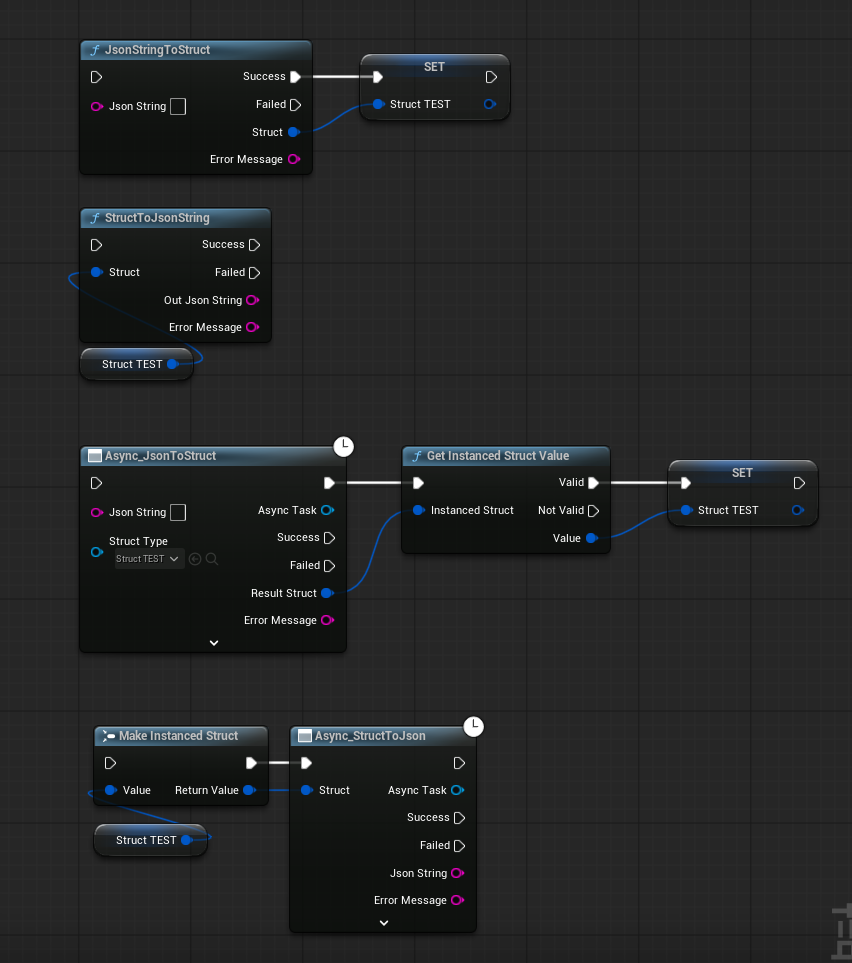
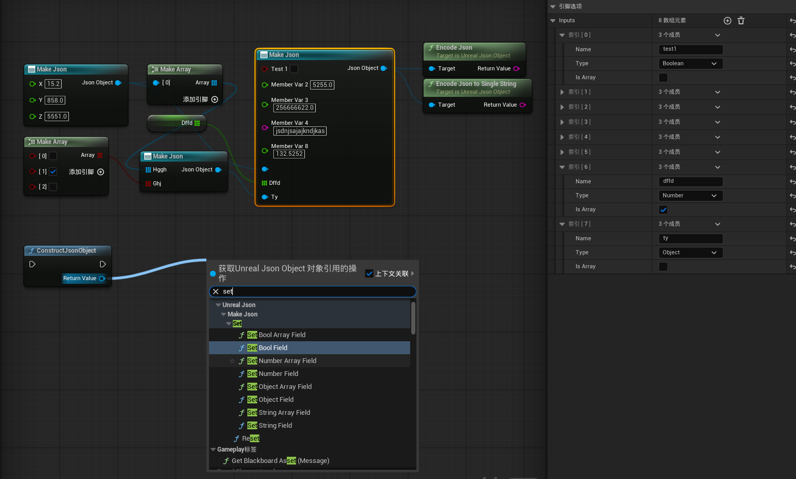
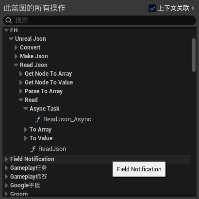
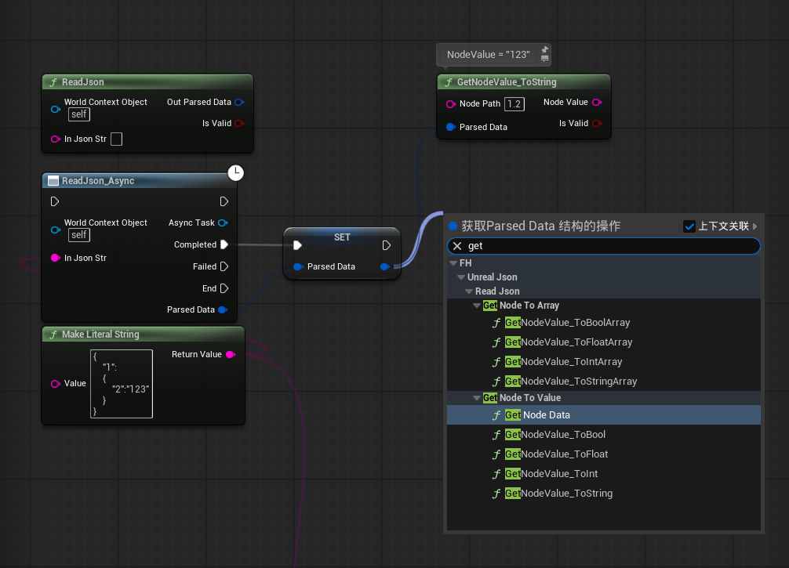
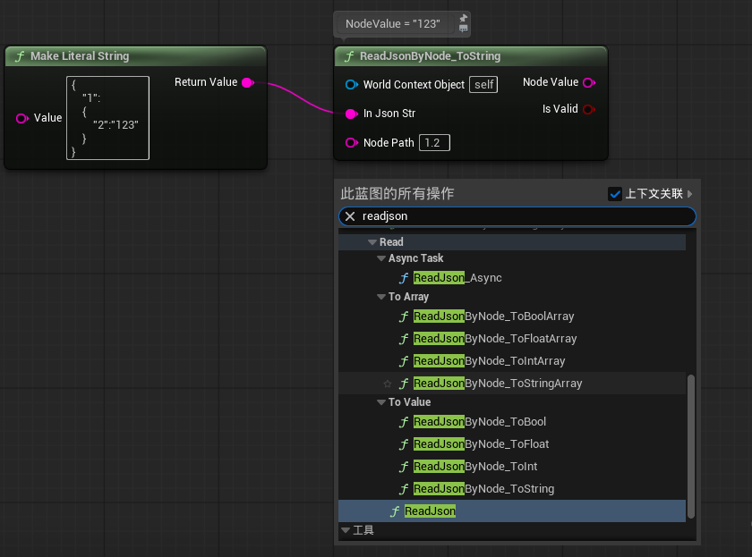

### 插件简介

原插件[UnrealReadJson](https://github.com/FHangH/UnrealReadJson) 升级版，在其基础上集合了更多的功能，并修复了原插件的一些问题。

### 插件模块
- [FanghLogger] 插件内容日志模块，也可以在别的项目中通用
- [StructJsonConverter]
    - 支持 struct 和 jsonstring 直接转换，在蓝图中支持任意 struct
    - 包含阻塞和异步两种方式
- [UnrealMakeJson] 初步集成了 VaRest 中 `MakeJson` 的 `K2Node`
- [UnrealReadJson] 和原插件功能一致，[UnrealReadJson](https://github.com/FHangH/UnrealReadJson)

### 蓝图节点

打字很累的，看看图吧

#### StructJsonConverter

#### UnrealMakeJson

#### UnrealReadJson

